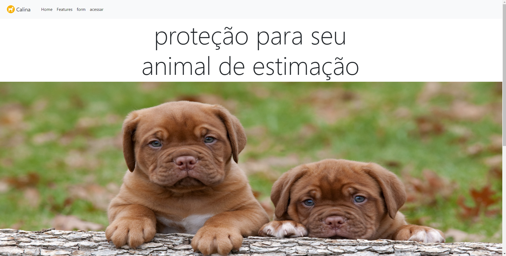
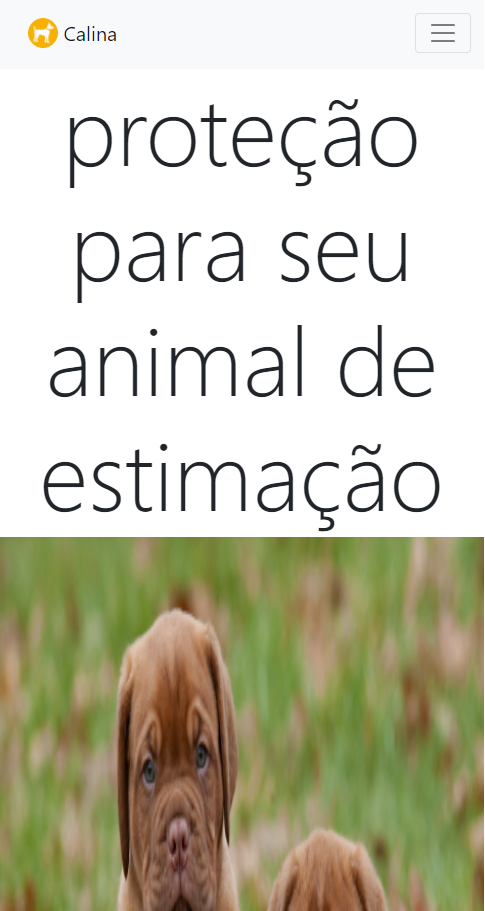

# projeto Calina

envia email com a classe [phpmailer()](https://github.com/vilmar-moreira-souza/Calina/tree/master/mailer)

#### necessario configurar SMTP na pagina envia.php, adicionando email e senha validos.

[visualizar](https://vilmar-moreira-souza.github.io/Calina/)

<h3> desktop</h3>

## mobile

<h3>sobre a aplicação</h3>

essa aplicação é uma landing page para contato, utilizando a classe php mailer para fazer o envio do email.   <a href="https://vilmar-moreira-souza.github.io/Calina/" target="blank">visualizar </a>  
   

## tecnologias usadas
 * html
 * css
 * javascript
 * php
 * bootstrap
<h3>ideias para implementar</h3>

 <li>melhorar o design</li>
<li> adicionar mais campos de contato </li>
<li> deixar carrousel mais dinamico, adicionando controle do usuario</li>
<li> mais...</li>

<h3>bugs e problemas</h3>

<li> o SMTP do gmail é limitado a certo numero de emails diarios, cerca de 500, portanto é ideal apenas para teste</li>
